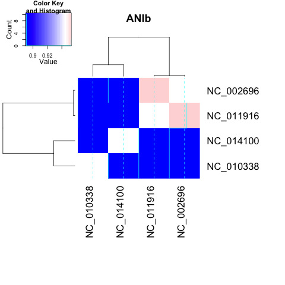
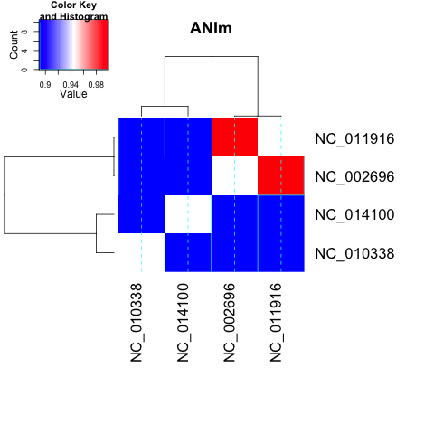
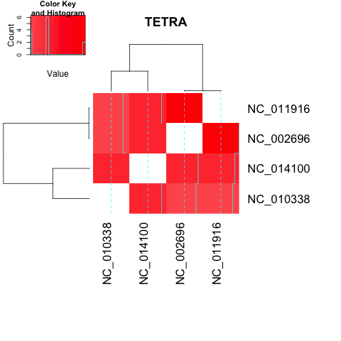

#README.md (average_nucleotide_identity)

## Overview
This repository contains code for calculating average nucleotide identity and related measures, and rendering relevant graphical summary output.

## DEPENDENCIES

### mandatory

* **Biopython** <http://www.biopython.org>
* **BLAST+** executable in the `$PATH`, or available on the command line (required for **ANIb** analysis) <ftp://ftp.ncbi.nlm.nih.gov/blast/executables/blast+/LATEST/>
* **MUMmer** executables in the $PATH, or available on the command line (required for **ANIm** analysis) <http://mummer.sourceforge.net/>

### optional, only required for graphical output

* **R** with shared libraries installed on the system <http://cran.r-project.org/>
* **Rpy2** <http://rpy.sourceforge.net/rpy2.html>


# INSTALLATION

If you have downloaded v0.1.0 or greater, and the dependencies above are satisfied, then installation should be as simple as cloning the repository:

```
$ git clone https://github.com/widdowquinn/average_nucleotide_identity
$ cd average_nucleotide_identity
```

then issuing:

```
$ python setup.py install
```

(or whatever variant you wish, e.g. for a home directory-local installation) from the top directory in the repository, with root permissions, if necessary.

## USAGE

### <a name="calculate_ani">`calculate_ani.py`</a>

This script calculates Average Nucleotide Identity (ANI) according to one of a number of alternative methods described in, e.g.

* Richter M, Rossello-Mora R (2009) Shifting the genomic gold standard for the prokaryotic species definition. Proc Natl Acad Sci USA 106: 19126-19131. doi:10.1073/pnas.0906412106. (ANI1020, ANIm, ANIb)
* Goris J, Konstantinidis KT, Klappenbach JA, Coenye T, Vandamme P, et al. (2007) DNA-DNA hybridization values and their relationship to whole-genome sequence similarities. Int J Syst Evol Micr 57: 81-91. doi:10.1099/ijs.0.64483-0.

ANI is proposed to be the appropriate *in silico* substitute for DNA-DNA 
hybridisation (DDH), and so useful for delineating species boundaries. A 
typical percentage threshold for species boundary in the literature is 95% 
ANI (e.g. Richter et al. 2009).

All ANI methods follow the basic algorithm:

- Align the genome of organism 1 against that of organism 2, and identify the matching regions
- Calculate the percentage nucleotide identity of the matching regions, as an average for all matching regions

Methods differ on: (1) what alignment algorithm is used, and the choice of parameters (this affects the aligned region boundaries); (2) what the input is for alignment (typically either fragments of fixed size, or the most complete assembly available).

* **ANIm**: uses MUMmer (NUCmer) to align the input sequences.
* **ANIb**: uses BLASTN to align 1000nt fragments of the input sequences
* **TETRA**: calculates tetranucleotide frequencies of each input sequence

This script takes as input a directory containing a set of correctly-formatted FASTA multiple sequence files. All sequences for a single organism should be contained in only one sequence file. The names of these files are used for identification, so it would be advisable to name 
them sensibly.

Output is written to a named directory. The output files differ depending on the chosen ANI method.

* **ANIm**: MUMmer/NUCmer .delta files, describing the sequence alignment; tab-separated format plain text tables describing total alignment lengths, and total alignment percentage identity
* **ANIb**: FASTA sequences describing 1000nt fragments of each input sequence; BLAST nucleotide databases - one for each set of fragments; and BLASTN output files (tab-separated tabular format plain text) - one for each pairwise comparison of input sequences. There are potentially a lot of intermediate files.
* **TETRA**: Tab-separated text file describing the Z-scores for each tetranucleotide in each input sequence.

In addition, all methods produce a table of output percentage identity (ANIm and ANIb) or correlation (TETRA), between each sequence.

If graphical output is chosen, the output directory will also contain PDF files representing the similarity between sequences as a heatmap with row and column dendrograms.

#### Usage

```
calculate_ani.py [options]

Options:
   -h, --help            show this help message and exit
   -o OUTDIRNAME, --outdir=OUTDIRNAME
                         Output directory
   -i INDIRNAME, --indir=INDIRNAME
                         Input directory name
   -v, --verbose         Give verbose output
   -f, --force           Force file overwriting
   -s, --fragsize        Sequence fragment size for ANIb
   --skip_nucmer         Skip NUCmer runs, for testing (e.g. if output already
                         present)
   --skip_blast          Skip BLAST runs, for testing (e.g. if output already
                         present)
   --noclobber           Don't nuke existing files
   -g, --graphics        Generate heatmap of ANI
   -m METHOD, --method=METHOD
                         ANI method
   --maxmatch            Override MUMmer settings and allow all matches in 
                         NUCmer
   --nucmer_exe=NUCMER_EXE
                         Path to NUCmer executable
   --blast_exe=BLAST_EXE
                         Path to BLASTN+ executable
   --makeblastdb_exe=MAKEBLASTDB_EXE
                         Path to BLAST+ makeblastdb executable
```

Example data and output can be found in the directory `test_ani_data`. The data are chromosomes of four isolates of *Caulobacter*. Analyses can be performed with the command lines:

```
$ ./calculate_ani.py -i test_ani_data/ -o test_ani_data_ANIb -m ANIb -g --format=png
$ ./calculate_ani.py -i test_ani_data/ -o test_ani_data_ANIm -m ANIm -g --format=png
$ ./calculate_ani.py -i test_ani_data/ -o test_ani_data_TETRA -m TETRA -g --format=png
```

which generate the following graphical output, supporting the assignment of `NC_002696` and `NC_011916` to the same species (*C.crescentus*), and the other two isolates to distinct species (`NC_014100`:*C.segnis*; `NC_010338`:*C.* sp K31):






## Licensing

Unless otherwise indicated, all code is subject to the following agreement:

    (c) The James Hutton Institute 2014, 2015
    Author: Leighton Pritchard

    Contact: leighton.pritchard@hutton.ac.uk

    Address: 
    Leighton Pritchard,
    Information and Computational Sciences,
    James Hutton Institute,
    Errol Road,
    Invergowrie,
    Dundee,
    DD6 9LH,
    Scotland,
    UK

The MIT License

Copyright (c) 2014-2015 The James Hutton Institute

Permission is hereby granted, free of charge, to any person obtaining a copy
of this software and associated documentation files (the "Software"), to deal
in the Software without restriction, including without limitation the rights
to use, copy, modify, merge, publish, distribute, sublicense, and/or sell
copies of the Software, and to permit persons to whom the Software is
furnished to do so, subject to the following conditions:

The above copyright notice and this permission notice shall be included in
all copies or substantial portions of the Software.

THE SOFTWARE IS PROVIDED "AS IS", WITHOUT WARRANTY OF ANY KIND, EXPRESS OR
IMPLIED, INCLUDING BUT NOT LIMITED TO THE WARRANTIES OF MERCHANTABILITY,
FITNESS FOR A PARTICULAR PURPOSE AND NONINFRINGEMENT. IN NO EVENT SHALL THE
AUTHORS OR COPYRIGHT HOLDERS BE LIABLE FOR ANY CLAIM, DAMAGES OR OTHER
LIABILITY, WHETHER IN AN ACTION OF CONTRACT, TORT OR OTHERWISE, ARISING FROM,
OUT OF OR IN CONNECTION WITH THE SOFTWARE OR THE USE OR OTHER DEALINGS IN
THE SOFTWARE.
